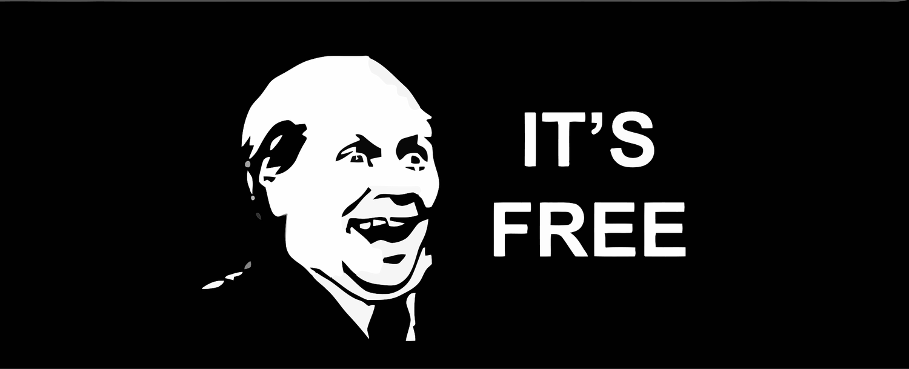

:title: LSyM - Laboratorio de Simulación y Modelado
:author: Carlos Reig matut
:description: Esta presentación es un resumen sobre las actividades que llevamos a cabo en el grupo de investigación LSyM de la Universidad de Valencia.
:keywords: simulación, simulation, 3d
:css: Presentacion.css

----

Bienvenidos
=============

.. image:: img/LSYM_logo.png

----

:data-rotate: 90
:data-scale: 2
:id: QuienSoy

Me presento
===========

*	Carlos Reig Matut

*	Desarrollador en LSyM por 2 años y medio

*	Ingeniero informático por la ETSE-UV

*	.. image:: img/twitterLogo.png
		:width: 100

	**@unstatu**

-----

¿Qué es el LSyM?
=================

El **Laboratorio de Simulación y Modelado** es un grupo de investigación perteneciente al IRTIC-UV.

Líneas de investigación
-----------------------

*	Modelos físicos de interacción con terreno
*	Sistemas de predicción de movimientos y ayuda al conductor

--------

:id: proyectos

**Proyectos**
=============

Simuladores tradicionales
-------------------------

*	Simulador Forklift
*	Simuladores portuarios
*	Simulator Retroexcavadora
*	Simulador grúa torre
*	...

Simuladores web
---------------
*	Simulador de eficiencia energética
*	Simulador de nivelación de terrenos

¿Quieres saber más?
-------------------
Puedes encontrar todos nuestros simuladores en www.uv.es/lsym

---------

¿Qué es un simulador?
======================

Un simulador es una aplicación informática que se utiliza para la formación de operarios de máquinas reales.

¿Por qué se usan simuladores?
------------------------------

Basicamente existen tres motivos:

#.	**No es peligroso** para el usuario
#.	Podemos recrear **situaciones críticas**

-------

Pero sobre todo...
===================

-------

Como cualquier aplicación informática, está compuesta por:

*	Software
*	Hardware

--------

:data-rotate: -90

Veamos el software...
=====================

Las partes más importantes del software de un simulador son:

*	Motor físico
*	Motor gráfico
*	Sistema de adquisición y gestión de eventos
*	IA
*	Gestión de memoria
*	Librerías matemáticas
*	etc.
*	**Sistema de instrucción**

---------

Por cierto...
=============

Casi todo el código de los simuladores está escrito en **C++**

----------

.. image:: img/homerGeometrico2.jpg

----------

:data-scale: 4

Demo
====

Hacemos algo parecido a esto

http://pedro-vk.github.io/Web2dWeb-Comparacion/

-----

:data-rotate-y: 90

Pero en 3D
==========

-------

:data-y: r9000

Hardware
========

http://www.youtube.com/watch?v=LVgVwjbDPGU#t=47

---------

¿Os interesa?
=============

Casi todos los que trabajamos aquí venimos de la ETSE

---------

Ya está todo
=============

**¿Dudas?**
